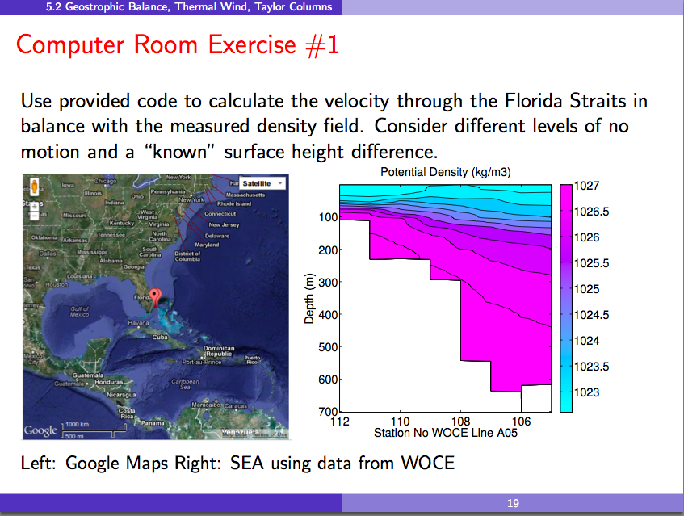

Exercise 1 - Thermal Wind
=========================

The goal is to explore the solution of the thermal wind equation between 2 WOCE stations in the Florida Straits.
The thermal wind equation
(in dimensional form)
is

.. math:

   \[ \frac{\partial v}{\partial z} = \frac{-g}{f_o \rho_o} \frac {\partial \rho}{\partial x}\]

where

* :math:`v` is the horizontal velocity component across the line between the 2 stations in :math:`m / s`

* :math:`g` is the acceleration due to gravity in :math:`m / s^2`

* :math:`f_o` is the Coriolis parameter in :math:`s^{-1}`

* :math:`\rho_o` is the reference density in :math:`kg / m^3`

* :math:`\rho` is the varying density in :math:`kg / m^3`

* :math:`x` is the horizontal distance between the 2 stations in :math:`m`

There are 2 choices of boundary conditions that can be used to solve the equation:

#. A depth at which there is no motion

#. A surface height difference between the 2 stations

The code provided integrates 2 density profiles and uses the chosen boundary condition to calculate the velocity component profile on the line connecting the profiles.

Also provided are a pair of density profiles at stations in the Gulf Stream where it passes through the Florida Straits.
These data were collected under the world project "WOCE" and are part of a large collection of data that is `freely available on the web`_.
The stations are at 26ºN and are 36.89 km apart.

.. _freely available on the web: http://www-pord.ucsd.edu/whp_atlas/

Your assignment:

Explore the velocity profiles that result with various choices for the no motion depth and for various surface height differences between the two stations.
The actual surface level at station 105 is probably about 40 cm higher than that at station 109.

.. _GetThePythonCode:

Get the Python Code
-------------------

Open up a terminal window and an editor.
If you don't have favourites that you use all the time,
the :guilabel:`Text Editor` icon on the AIMS computers will bring up :program:`gedit` for you with terminal,
editor,
and file navigator panes.

In the terminal,
clone the Mercurial repository that contains the code and data
(as well as a PDF of this morning's slides),
change to the :file:`thermal_wind` directory,
and start :program:`ipython` with plotting enabled:

.. code-block:: sh

    $ git clone git@github.com:UBC-MOAD/AIMS-Workshop.git
    $ cd AIMS-Workshop
    $ ipython --pylab

The Python functions we're going to use in this exercise are in :mod:`thermal_wind.py`.
You can explore the code by opening it in the editor pane.

The :func:`thermal_wind` Function
---------------------------------

The :func:`thermal_wind` function has the following docstring that tells us about what it does,
its inputs,
its outputs,
and the exceptions that it may raise:

.. autofunction:: thermal_wind.thermal_wind

The :func:`plot_velocity_profile` Function
------------------------------------------

The docstring from the :func:`plot_velocity_profile` is:

.. autofunction:: thermal_wind.plot_velocity_profile

An Example
----------

.. code-block:: python

    In []: import thermal_wind

    In []: depth, v = thermal_wind.thermal_wind('s109.dens', 's105.dens', surface_delta=0)

    In []: thermal_wind.plot_velocity_profile(depth, v)

Now,
it's your turn...
