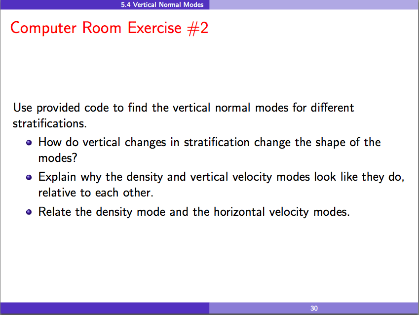

Exercise 2 - Calculation of Vertical Dynamic Ocean Modes
========================================================

Based on http://woodshole.er.usgs.gov/operations/sea-mat/klinck-html/dynmodes.html by John Klinck, 1999.

The goal is to calculate and explore the vertical dynamic modes using a Python function that calculates numerical solutions of the generalized eigenvalue problem expressed by:

  .. math::
     :label: NormalMode

     \frac{\partial^2}{\partial z^2} w_m + \alpha^2 N^2 w_m = 0

with boundary conditions of :math:`w_m = 0` at the surface and the bottom.

Variables:

* :math:`z` is the vertical coordinate, measured in :math:`[m]`
* :math:`w_m` are the vertical velocity modes
* :math:`N^2` is a profile of Brunt-Vaisala (buoyancy) frequencies squared :math:`[s^{-2}]`
* :math:`\alpha^2` are the eigenvalues

Your assignment:

Get the Python Code
-------------------

Open up a terminal window and an editor,
and go to the :file:`dynmodes` directory.

Please see the :ref:`GetThePythonCode` section in Exercise 1 if you haven't already cloned the `AIMS-workshop`_ repository from bitbucket.org.

.. _AIMS-workshop: https://bitbucket.org/douglatornell/aims-workshop/

Change to the :file:`aims-workshop/dynmodes` directory and start :program:`ipython` with plotting enabled.

The Python functions we're going to use in this exercise are in :mod:`dynmodes.py`.

The :func:`dynmodes` Function
-----------------------------

The :func:`dynmodes` function has the following docstring that tells us about what it does,
its inputs,
and its outputs:

.. autofunction:: dynmodes.dynmodes

Analytical Test Cases
---------------------

For unit depth and uniform, unit :math:`N^2` the analytical solution of the :eq:`NormalMode` is:

.. math::

   w_m = w_o \sin(\frac{z}{ce})

where

.. math::

   ce = \frac{1}{n \pi}

and :math:`w_o` is an arbitrary constant, taken as 1.

Calculate the 1st 3 dynamic modes for this case using :func:`dynmodes`:

.. code-block:: python

    In []: import numpy as np

    In []: import dynmodes

    In []: depth = np.linspace(0, 1, 21)

    In []: Nsq = np.ones_like(depth)

    In []: wmodes, pmodes, rmodes, ce = dynmodes.dynmodes(Nsq, depth, 3)

    In []: ce
    Out[]: array([ 0.31863737,  0.15981133,  0.10709144])

Calculate the 1st 3 modes of the analytical solution for this case:

.. code-block:: python

    In []: const = 1 / np.pi

    In []: analytical = np.array((const, const / 2, const / 3))

    In []: analytical
    Out[]: array([ 0.31830989,  0.15915494,  0.1061033 ])

Finally,
plot :math:`N^2` and the vertical and horizontal modes,
and the vertical density modes:

.. code-block:: python

    In []: dynmodes.plot_modes(Nsq, depth, 3, wmodes, pmodes, rmodes)

Another case with an analytical solution that you can try is:

* 400 :math:`m` depth at 10 :math:`m` intervals

* Uniform :math:`N^2 = 1 \times 10^{-6} \ s^{-2}`

The analytical solution is:

.. math::

    w_m = w_o \sin(\frac{N z}{ce})

where

.. math::

    ce = \frac{N H}{n \pi}, N = 1 \times 10^{-3} \ s^{-2}, H = 400 \ m

Exploring Different Stratifications
-----------------------------------

There are 4 density profile files for you to explore:

* :file:`SoG_S3.dens` is from the Strait of Georgia on the west coast of Canada

* :file:`s105.dens` and :file:`s109.dens` are from Florida Straits

* :file:`so550.dens` is from the South Atlantic offshore of Cape Town

The :func:`dynmodes.read_density_profile` function will read those files and return depth and density arrays.
You can view its docstring via the :program:`ipython` help feature:

.. code-block:: python

    In []: dynmodes.read_density_profile?

The :func:`dynmodes.density2Nsq` function will convert a density profile to a profile of Brunt-Vaisala (buoyancy) frequencies squared.
